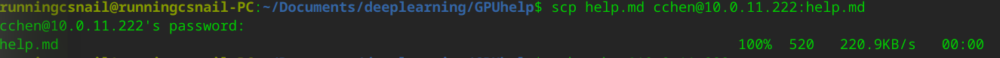
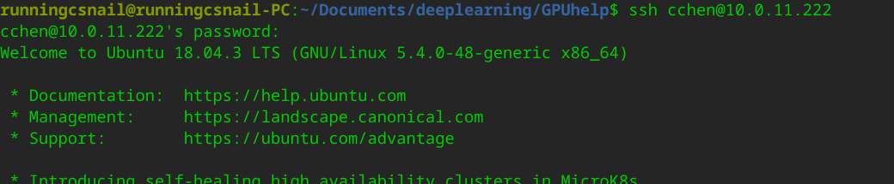
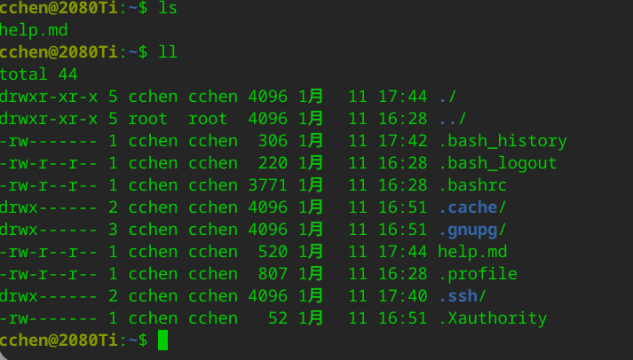

[toc]

# GPU连接与使用指南

操作系统：linux

在此以 `IP：10.0.11.222`；`账户：cchen`; `密码：cchen_123` 为例。

# 1. 连接/断开GPU

得到IP，用户名，密码后，使用`ssh`命令连接GPU，命令如下：

```shell
$ ssh -l cchen 10.0.11.222
```

或者：

```shell
$ ssh cchen@10.0.11.222
```

断开GPU服务命令：

```shell
$ exit
```

# 2. 查看GPU状态

```shell
$ nvidia-smi
```

# 3. 远程文件拷贝（secure copy）
远程文件拷贝使用`scp`命令，即 secure copy

## 3.1. 拷贝单个文件

+ 例如，将单个本地文件（如`help.md`）拷贝到服务器，在**本地用户目录**下，命令如下：

  ```shell
  $ scp help.md cchen@10.0.11.222:help.md
  ```

  如图：
  其中`runningcsnail`是本地用户名字，`～/Documents/deeplearning/GPUhelp`是文件所属目录，输入`scp`命令行后，根据提示输入密码，即可copy文件到服务器。

+ 将远程文件拷贝到本地，在**本地用户目录**下，一般命令如下：

  ```shell
  $ scp cchen@10.0.11.222:help.md help.md
  ```

## 3.2. 查看文件是否传输成功：

参考步骤`1.连接/断开GPU`，连接GPU，使用`ls`或`ll`命令查看文件，如图：





## 3.3. 拷贝整个文件夹：

+ 将本地文件夹(如：GPUhelp文件夹)拷贝到服务器上，在**本地用户目录**下，命令如下：

  ```shell
  $ scp -r GPUhelp cchen@10.0.11.222:GPUhelp
  ```

+ 将远程文件夹拷贝到本地，在本地用户目录下，一般命令如下：

  ```shell
  $ scp -r 用户名@地址:目录/文件夹/ 本地目录/文件夹新名称/
  ```

  例如：

  ```shell
  $ scp -r cchen@10.0.11.222:GPUhelp/ localGUPhelp/
  ```

  
