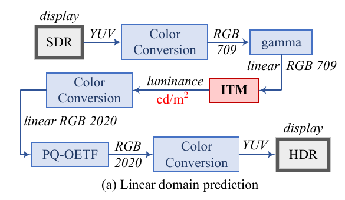
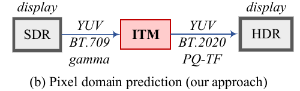
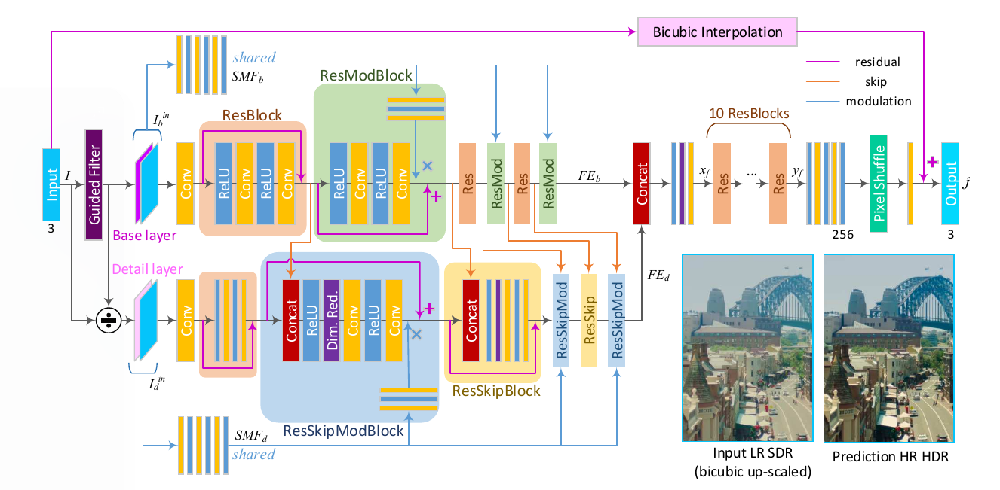

# 1. 准备工作

github地址：https://github.com/greatwallet/Pytorch-Implemented-Deep-SR-ITM

markdown数学符号: https://blog.csdn.net/weixin_42047611/article/details/109325216

## 1.1. 环境准备：

参考下述linux命令行：

在gpu服务器cchen用户的hdr目录下，创建python3虚拟环境：

```python
virtualenv -p python3 SR_ITM
```

启动虚拟环境

```shell
~/hdr/SR_ITM$ source bin/activate
```

检查`pip`更新

```shell
python3 -m pip install --upgrade pip
```

安装准备环境

```shell
~/hdr/SR_ITM$ python3 -m pip install torch torchvision opencv-python numpy
~/hdr/SR_ITM$ python3 -m pip3 install opencv-contrib-python
```

克隆代码库

```shell
~/hdr/SR_ITM$ clone https://github.com/greatwallet/Pytorch-Implemented-Deep-SR-ITM.git
```

## 1.2. 数据准备

1. 从 https://github.com/sooyekim/Deep-SR-ITM下载训练集和测试集

2. 参考如下matlab脚本，将.mat文件格式转换为.png格式

   ```matlab
   %% 
   % 这是HDR数据.mat文件的转换脚本
   
   clear; tic; 
   set(gcf, 'Renderer', 'ZBuffer');
   
   HDR_data = load('F:\下载\train\HDR_youtube_80.mat');
   % load('.mat文件路径')
   
   HDR_data = HDR_data.HDR_data;
   % 如果是针对test文件夹中的.mat数据文件，此行代码改为HDR_data = HDR_data.HDR;
   
   N = size(HDR_data, 4);
   for i = 1:N
       disp(i);
       img = HDR_data(:, :, :, i);
       imwrite(img, [sprintf('%06d.png', i)]);
   end
   ```

   转换SDR数据`.mat`文件时，将上述脚本中的HDR字段换成SDR
   
3. 使用`scp`命令将数据上传至服务器，放在项目目录`data`文件夹中(新建`data`文件夹)

## 1.3. 代码调试

确保已经启动虚拟环境`SR_ITM`

在项目目录下，创建名为`data`的文件夹，用来放置数据，创建文件夹命令为`mkdir data`

例如：项目路径`~/hdr/SR_ITM/Pytorch-Implemented-Deep-SR-ITM`，创建data文件夹后，文件结构如下

```shell
cchen@2080Ti:~/hdr/SR_ITM/Pytorch-Implemented-Deep-SR-ITM$ tree 
.
├── data  #这是存放数据的文件夹
├── dataset.py 
├── LICENSE
├── metrics.py
├── models.py
├── README.md
├── test.py
├── train_base_net.py #这是执行训练的脚本，规定了各种训练参数
├── train_full_net.py
└── utils.py

1 directory, 9 files
```

### 1.3.1. 训练

通过命令行`nvidia-smi`查看gpu的id，本次`gpu_id=0`，编辑`train_base_net.py` 寻找`gpu_id`字符串，更改其值。

通过命令行`cd 文件路径` ，进入`train_base_net.py`所在目录，执行：

```python
python3 -m train_base_net.py
```

### 1.3.2. 代码变量声明

**形参变量：**

`root_dir = 'data的路径'` 如果数据与项目在同一文件目录下(参见1.3 文件树)，`root_dir = 'data'`


#### 图像质量评价指标：

`mse` 均方误差(Mean Square Error)

`psnr` 峰值信躁比(Peak Signal to Noise Ratio)

`ssim` 结构相似性(Structural Similarity)

`ms_ssim`多尺度结构相似

`criterion` 评价标准

SSIM and MS-SSIM functions are borrowed from [VainF/pytorch-msssim](https://github.com/VainF/pytorch-msssim)

# 2. 论文回顾

题目：

Deep SR-ITM: Joint Learning of Super-Resolution and Inverse Tone-Mapping for 4K UHD HDR Applications

深度超分逆色调映射(SR-ITM)：应用于4K超高清(UHD, Ultra High Definition)高动态(HDR)超分与逆色调映射联合学习

正文回顾：

## 2.1. 方法导引

+ 输入图像信号被分解成基础层和细节层，两层分别提取特征。

+ 设计空间调试块

  卷积操作并不适合增强本地对比度，因为这是空间等变的，所有像素以滑动窗口的方式使用相同的过滤。因此设计乘法操作的空间变化调试块（特定像素位置），调节局部强度。生成的调试映射也是特定于图像的，不同于卷积过滤器，一旦训练后所有的图像都是固定的。

+ 像素域上预测

  功能上与之前的ITM（逆色调映射）方法不同，原ITM旨在线性域上预测图像亮度，即场景的物理亮度(cd/m^2)，本文的网络在像素域上直接预测hdr显示格式的HR HDR图像。

  

  故色彩域BT.709拓展到BT.2020（超高清），深度从每像素8bit增加至10bit。转换函数`gamma`; `PQ`;`HLG`;`OETF`。本文使用了4K(3840x2160)HDR视频进行训练。

  

  几个转换函数的参考文献：[1] [3] [4]

  **本文三方面贡献：**

  1. 针对组合SR-ITM问题，引入带调试块、且增强局部对比的新深度网络。
  2. 用Deep SR-ITM的输入分解方法聚焦差异的高低频分量。
  3. 以HDR标准格式直接预测HR HDR图像

  ## 2.2. 可能参考的文献

+ HDR [14] [15] ，[14]应用色域有限，只针对强光，[15]CNN自编码器结构，可能丢失重要的空间信息。

+ SR [16]提出CNN超分，[17]pixel shuffler像素转化; [18]residual learning残差学习; [19-20, 22-23]residual blocks残差块; [21-22]密集连接; [23]channel attention blocks通道注意块。

+ [26]分区域分析guided filter

线性整流函数[27]

## 2.3. SR-ITM

   

### 2.3.1. 分解输入

$ I$  :低分辨率(LR)，标准动态范围(SDR)图像 输入;

$ I_b$: 输入被分解所得基础层(base layer); 此处使用引导过滤(guided filter，边缘保留的低通道过滤)

$ I_d$:输入分解所得细节层 (detail layer); 去除$ I_b$所得。
$$
I_d=I \oslash I_b
$$
**顶层：**$I_b$做颜色转换，拓展振幅(amplitude)，

**底层：**细节层$I_d$保留高分辨率细节。

### 2.3.2. 残差越过调试模块(ResSkipModBloch)

Residual skip modulation blocks

卷积层中的卷积操作在空间上是等变的，因为相同的卷积过滤被应用到了所有的像素位置。如果想增强局部差异，卷积操作的这一特点会限制网络的能力。故增加了注意力机制，逐像素调制图像信号。

+ Residual Blocks：

  首先，$x$ 作为第 $i$ 个ResBlock模块的输入，输出：
  $$
  ResBlock_i(x) = (Conv \circ ReLU \circ Conv \circ ReLU)(x) + x = C_{RB}(x) + x
  $$
  


+ Shared Modulation Features($SMF_b$)
  $$
  SMF_b = (ReLU \circ Conv \circ ReLU \circ Conv \circ ReLU \circ Conv)(I_b^{in})
  $$

+ Residual Modulation Block(ResModBlock)
  $$
  ResModBlock_i = C_{RB}(x) \odot {(Conv \circ ReLU \circ Conv)(SMF_b)} + x
  $$
  $\odot$ 是元素乘法

+ Feature Extraction(FE)
  $$
  FE_b = (ResModBlock_m \circ ResBlock_m^b \circ ... \circ ResModBlock_1 \circ ResBlock_1 \circ Conv)(I_b^{in})
  $$

...

+ 其他(详见论文)

## 2.4. 实验结果

所有的卷积过滤都是（3,3）大小，64输出通道，除了像素洗牌前的256通道。输出层3通道

# 3. 代码设计

## 3.1. dataset.py（数据设置）

```python
变量：
SDR_dir #SDR文件路径
HDR_dir #HDR文件路径
phase #操作语句，默认是"train"训练，可以是"test"
scale #帧数
file_type #数据文件类型
N_SDR #SDR的.png文件数量 = self.len

类
Dataset
属性
SDR_dir
HDR_dir
phase
scale
file_type

函数
__len__  #返回SDR图片数量
__gititem__ #将输入的参数张量转化为列表
```

找到SDR_dir

```python
class Dataset(Dataset):
    def __init__(self, SDR_dir, HDR_dir, phase="train", scale=None, file_type='png'):
        self.SDR_dir = SDR_dir
        self.HDR_dir = HDR_dir
        self.phase = phase
        self.scale = scale
        self.file_type = file_type
        
        if phase != "train" and phase != "val" aand phase != "test":
            raise ValueError("Expecting `phase` to be {}, {} or {} but got {}"
                                .format("train", "val", "test", phase))

        if phase == "val" and scale is None:
                raise ValueError("scale must be specified if `phase` == {}"
                                .format(phase))

        #glob遍历检索文件，osp.join()加入文件路径，*.png
        N_SDR = len(glob(osp.join(self.SDR_dir, '*.{}'.format(self.file_type))))

        if self.phase != "test":
            N_HDR = len(glob(osp.join(self.HDR_dir,'*.{}'.format(self.file_type))))
            N_HDR = len(glob(osp.join(self.HDR_dir,'*.{}'.format(self.file_type))))
        if N_SDR != N_HDR:
            raise ValueError("SDR image amount ({}) and HDR image amount({}) are not identical".format(N_SDR, N_HDR))if N_SDR != N_HDR:
            raise ValueError("SDR image amount ({}) and HDR image amount({}) are not identical".format(N_SDR, N_HDR))


            self.len = N_SDR
	
    def __len__(self):
        return self.len
    
    def __getitem__(self, idx):
        if torch.is_tensor(idx):
            idx = idx.tolist() #将张量转化为列表
            
        SDR_name = osp.join(self.SDR_dir, '{:06d}.{}'.format(idx + 1))
```

